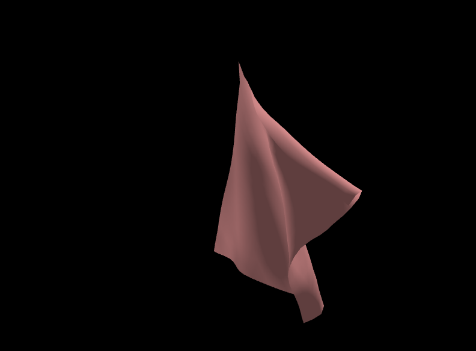
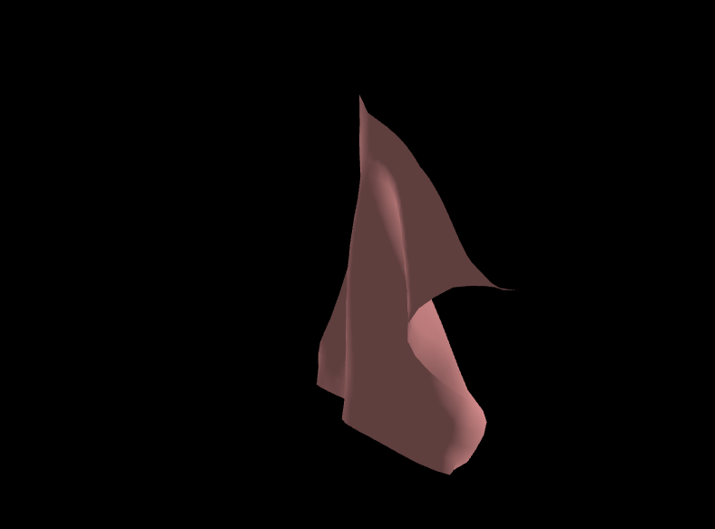

# Controls

- G and H to move between fixpoints (points which can be held constant to lift up the cloth)
- F and U to fix/unfix selected point
- W,A,S,D to move all fixpoints in the 4 cardinal directions
- K,L to move all fixpoints up and down
- B,V to increase/decrease wind speed
- C to reset wind
- R to reset camera
- hold right click and move cursor to zoom
- hold left click to pan

N.B: Do not click off the simulation tab, as this will break the simulation.

# Gallery

